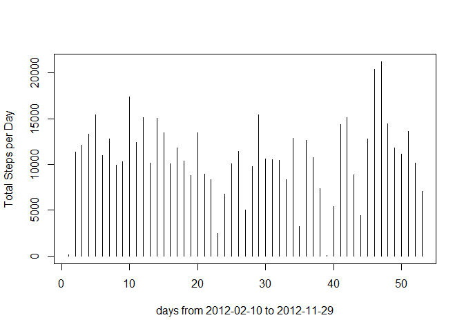
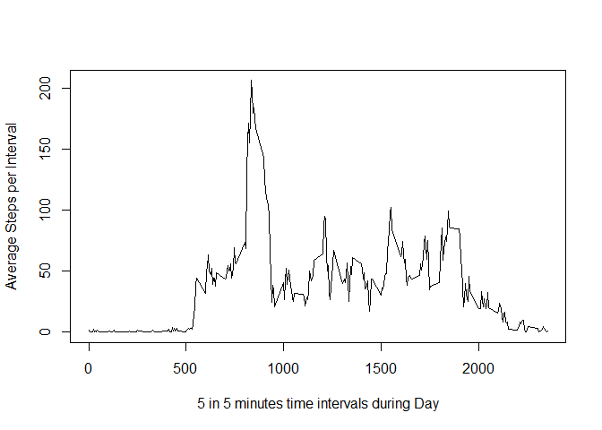
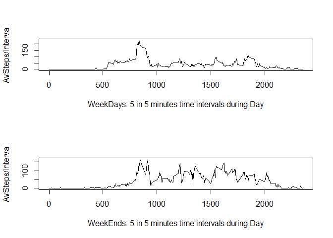

## Loading and preprocessing the data
This document needs previous reading of the README file (with project objectives)


```r
library(dplyr)
```

```
## 
## Attaching package: 'dplyr'
```

```
## The following objects are masked from 'package:stats':
## 
##     filter, lag
```

```
## The following objects are masked from 'package:base':
## 
##     intersect, setdiff, setequal, union
```

```r
uncl_activity_data <- read.csv("activity.csv")
print(head(uncl_activity_data,3))
```

```
##   steps       date interval
## 1    NA 2012-10-01        0
## 2    NA 2012-10-01        5
## 3    NA 2012-10-01       10
```

```r
dim(uncl_activity_data)
```

```
## [1] 17568     3
```

My option was to work with a clean df "activity_data" without NA rows  
"uncl_activity_data" df is the original data file

```r
activity_data <- uncl_activity_data[!is.na(uncl_activity_data$steps),]
print(head(activity_data,3))
```

```
##     steps       date interval
## 289     0 2012-10-02        0
## 290     0 2012-10-02        5
## 291     0 2012-10-02       10
```

```r
dim(activity_data)
```

```
## [1] 15264     3
```


## What is mean total number of steps taken per day?

```r
tSPD <- aggregate(steps ~ date, activity_data, sum)
tSPD
```

```
##          date steps
## 1  2012-10-02   126
## 2  2012-10-03 11352
## 3  2012-10-04 12116
## 4  2012-10-05 13294
## 5  2012-10-06 15420
## 6  2012-10-07 11015
## 7  2012-10-09 12811
## 8  2012-10-10  9900
## 9  2012-10-11 10304
## 10 2012-10-12 17382
## 11 2012-10-13 12426
## 12 2012-10-14 15098
## 13 2012-10-15 10139
## 14 2012-10-16 15084
## 15 2012-10-17 13452
## 16 2012-10-18 10056
## 17 2012-10-19 11829
## 18 2012-10-20 10395
## 19 2012-10-21  8821
## 20 2012-10-22 13460
## 21 2012-10-23  8918
## 22 2012-10-24  8355
## 23 2012-10-25  2492
## 24 2012-10-26  6778
## 25 2012-10-27 10119
## 26 2012-10-28 11458
## 27 2012-10-29  5018
## 28 2012-10-30  9819
## 29 2012-10-31 15414
## 30 2012-11-02 10600
## 31 2012-11-03 10571
## 32 2012-11-05 10439
## 33 2012-11-06  8334
## 34 2012-11-07 12883
## 35 2012-11-08  3219
## 36 2012-11-11 12608
## 37 2012-11-12 10765
## 38 2012-11-13  7336
## 39 2012-11-15    41
## 40 2012-11-16  5441
## 41 2012-11-17 14339
## 42 2012-11-18 15110
## 43 2012-11-19  8841
## 44 2012-11-20  4472
## 45 2012-11-21 12787
## 46 2012-11-22 20427
## 47 2012-11-23 21194
## 48 2012-11-24 14478
## 49 2012-11-25 11834
## 50 2012-11-26 11162
## 51 2012-11-27 13646
## 52 2012-11-28 10183
## 53 2012-11-29  7047
```

```r
plot(1:length(tSPD$steps), tSPD$steps, type="h", xlab = "days from 2012-02-10 to 2012-11-29", ylab = "Total Steps per Day")
```

<!-- -->

```r
print(paste("Mean StepsPerDay = ",round(mean(tSPD$steps),1)))
```

```
## [1] "Mean StepsPerDay =  10766.2"
```

```r
print(paste("Median StepsPerDay = ",round(median(tSPD$steps),1)))
```

```
## [1] "Median StepsPerDay =  10765"
```


## What is the average daily activity pattern?

```r
aSPI <- aggregate(steps ~ interval, activity_data, mean)
plot(aSPI$interval, aSPI$steps, type="l", xlab = "5 in 5 minutes time intervals during Day", ylab = "Average Steps per Interval")
```

<!-- -->

```r
aSPI_ordered <- arrange(aSPI, desc(steps))
```

```
## Warning: package 'bindrcpp' was built under R version 3.4.2
```

```r
print(paste("5 mn interval with higherav steps = ", aSPI_ordered$interval[1]))
```

```
## [1] "5 mn interval with higherav steps =  835"
```


## Imputing missing values

```r
nanum = sum(is.na(uncl_activity_data$steps))
print(paste("total number of missing values = ", nanum))
```

```
## [1] "total number of missing values =  2304"
```
My option was to replace steps=NA on "uncl_activity_data"" df by the equivalent average of each interval (aSPI and avgs variables below)  
the final data is on the "activity_data_new"" df

```r
daysnum <- length(levels(uncl_activity_data$date)) 
aSPI <- aggregate(steps ~ interval, uncl_activity_data, mean)
avgs <- aSPI[rep(seq_len(nrow(aSPI)), daysnum),]
na_index <- is.na(uncl_activity_data$steps)
activity_data_new <- uncl_activity_data
activity_data_new[na_index,]$steps <- avgs[na_index,]$steps
```


```r
tSPD_new <- aggregate(steps ~ date, activity_data_new, sum)
plot(1:length(tSPD_new$steps), tSPD_new$steps, type="h", xlab = "days from 2012-02-10 to 2012-11-29", ylab = "Total Steps per Day")
```

<!-- -->

```r
print(paste("Mean StepsPerDay = ",round(mean(tSPD_new$steps),1)))
```

```
## [1] "Mean StepsPerDay =  10766.2"
```

```r
print(paste("Median StepsPerDay = ",round(median(tSPD_new$steps),1)))
```

```
## [1] "Median StepsPerDay =  10766.2"
```
Conclusion: The values don't differ much from the estimates from the first part of the assignment.  There is no impact no from missing data on the estimates of the total daily number of steps

## Are there differences in activity patterns between weekdays and weekends?


```r
weekend <- format(as.Date(activity_data_new$date), format="%a") %in% c("Sat", "Sun")
activity_data_new <- mutate(activity_data_new, weekend="weekday")
activity_data_new[weekend,]$weekend <- "weekend"
activity_data_new$weekend <- as.factor(activity_data_new$weekend)
```


```r
par(mfrow=c(2,1))
aSPI_weekD <- aggregate(steps ~ interval, activity_data_new[activity_data_new$weekend=="weekday",], mean)
plot(aSPI_weekD$interval, aSPI_weekD$steps, type="l", xlab = "WeekDays: 5 in 5 minutes time intervals during Day", ylab = "AvSteps/Interval")
aSPI_weekD <- aggregate(steps ~ interval, activity_data_new[activity_data_new$weekend=="weekend",], mean)
plot(aSPI_weekD$interval, aSPI_weekD$steps, type="l", xlab = "WeekEnds: 5 in 5 minutes time intervals during Day", ylab = "AvSteps/Interval")
```

<!-- -->
  
  
Conclusion: During weekends the activity is much more flat over time


